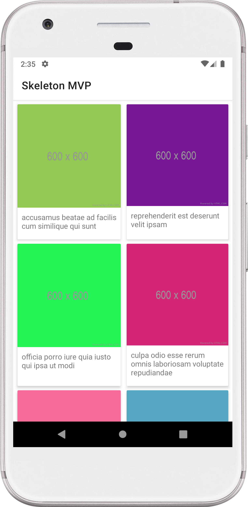
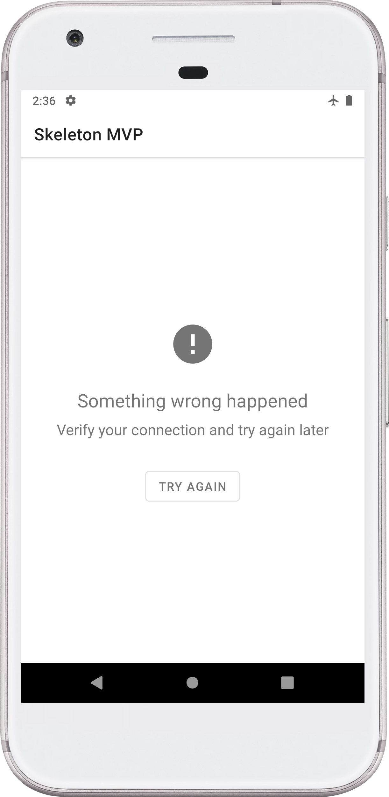

# android-skeleton-mvp

[](https://travis-ci.org/brunogabriel/android-skeleton-mvp) [](https://circleci.com/gh/brunogabriel/android-skeleton-mvp) [](https://codecov.io/gh/brunogabriel/android-skeleton-mvp) [](https://codebeat.co/projects/github-com-brunogabriel-android-skeleton-mvp-master)

A basic structure to start new projects using Model View Presenter (MVP) architecture.

## Built With

* [Kotlin](https://kotlinlang.org/) - Programming Language
* [Model View Presenter](https://en.wikipedia.org/wiki/Model%E2%80%93view%E2%80%93presenter) - Architecture
* [Koin](https://github.com/InsertKoinIO/koin) - Dependency Injection
* [Room](https://developer.android.com/training/data-storage/room) - Database
* [Robots](https://jakewharton.com/testing-robots/) - Robots pattern to create stable, readable, and maintainable tests with Kotlin (Instrumental tests)
* [Wiremock](http://wiremock.org/) - Mock APIs
* Libraries, tools, etc.: [Material Design Visual](https://material.io/design/), [Retrofit2](https://square.github.io/retrofit/), [GSON](https://github.com/google/gson), [RxJava/Android 2](https://github.com/ReactiveX/RxJava), [Picasso](https://square.github.io/picasso/), [Stetho](http://facebook.github.io/stetho/), [Kotlin Mockito](https://github.com/nhaarman/mockito-kotlin) etc.''

## API
The API used is [JSONPlaceholder](https://jsonplaceholder.typicode.com/), the data model is [album](https://jsonplaceholder.typicode.com/photos):
```json
[
  {
    "albumId": 1,
    "id": 1,
    "title": "accusamus beatae ad facilis cum similique qui sunt",
    "url": "https://via.placeholder.com/600/92c952",
    "thumbnailUrl": "https://via.placeholder.com/150/92c952"
  },
  {
    "albumId": 1,
    "id": 2,
    "title": "reprehenderit est deserunt velit ipsam",
    "url": "https://via.placeholder.com/600/771796",
    "thumbnailUrl": "https://via.placeholder.com/150/771796"
  },
  {
    "albumId": 1,
    "id": 3,
    "title": "officia porro iure quia iusto qui ipsa ut modi",
    "url": "https://via.placeholder.com/600/24f355",
    "thumbnailUrl": "https://via.placeholder.com/150/24f355"
  } 
]
```

## Showcase

<p>
    
    <div width="50"></div>
    
</p>

## License

This project is licensed under the MIT License - see the [LICENSE](LICENSE) file for details
